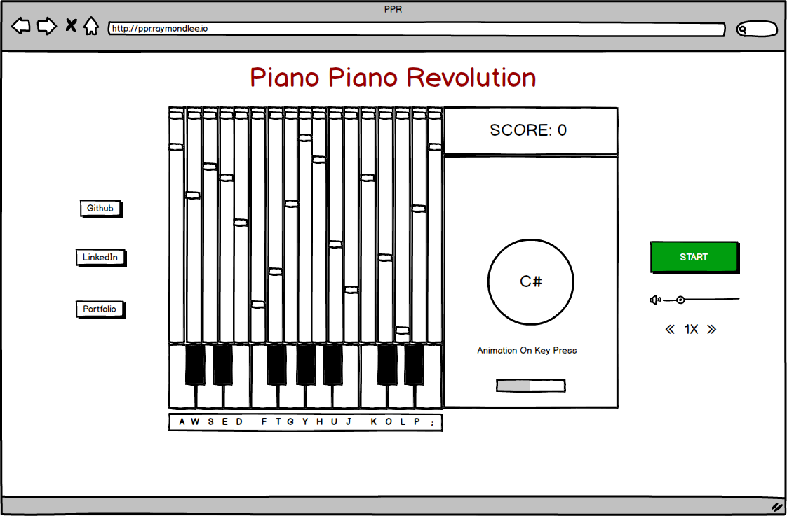

## Piano Piano Revolution

### Background

Piano Piano Revolution is an adaptation of Dance Dance Revolution. In the original DDR, players stand on a dance platform or stage and hit colored arrows laid out in a cross with their feet to musical and visual cues. Players are judged by how well they time their dance to the patterns presented to them. This project will incorporate the core concept but with added visual animation and keys, outlined in the **Functionality & MVP** and **Bonus Features** sections.

### Functionality & MVP

With Piano Piano Revolution, users will be able to:

- [ ] Start and reset the game
- [ ] Play or mute the sound
- [ ] Press piano keys as arrow keys to match the blocks falling.
- [ ] Visualize pattern matching score
- [ ] Animation when keys are pressed

In addition, this project will include:

- [ ] A production README

### Wireframes

This app will consist of a single screen with game board, game, controls, and nav links to the Github, LinkedIn, and Portfolio.
Game controls will include Start and Reset buttons as well as buttons to set the speed.

### Architecture and Technologies

This project will be implemented with the following technologies:

- Vanilla JavaScript and `jquery` for overall structure and game logic,
- Webpack to bundle and serve up the various scripts,
- `Howler.js` for audio,
- `HTML5 Canvas` for DOM manipulation and rendering,
- `anime.js` to create beautiful animations with the keydown event.

In addition to the webpack entry file, there will be multiple scripts involved in this project:

`animations.js`: this script will create special effects on key press.

`keycodes.js`: this script will handle the keys in piano.

`sounds.js`: this script will connect the keys to sound files.

`main.js`: this script will handle the logic for the board and rendering.

`blocks.js`: this script will house the constructor and update functions for the `Block` objects.  Each `Block` will contain a `note` (piano notes), `time` (at which it should be played), and `hit` (`true` or `false`).

`utils.js`: this script will handle vector math for the blocks.

`logo.js`: this script will handle the logo using `anime.js`.

### Implementation Timeline

**Day 1**: Setup all necessary Node modules, including getting webpack up and running.  Create `webpack.config.js` as well as `package.json`.  Write a basic entry file and the bare bones of all 6 scripts outlined above.  Learn the basics of `anime.js`.  Goals for the day:

- Get a green bundle with `webpack`
- Render an object to the `Canvas` element
- Create logo animations and key press using `anime.js`

**Day 2**: Dedicate this day to creating piano and blocks. Goals for the day:

- Complete the `blocks.js` module (constructor, update functions)
- Render a background to the `Canvas`
- Render a functioning piano object connected to sounds

**Day 3**: Create the blocks moving according to a song. Goals for the day:

- Build DB on notes and timestamps to create velocity each blocks should move down.
- Build interaction between the blocks and key pressed with piano to keep track of score based on hit/miss.

**Day 4**: Install the controls for the user to interact with the game.  Style the frontend, making it polished and professional.  Goals for the day:

- Create controls for start, reset
- Have a styled `Canvas`, nice looking controls and title

### Bonus features

There are many directions this Piano Piano Revolution could eventually go.  Some anticipated updates are:

- [ ] Add options for faster speed
- [ ] Add options for smaller volume
- [ ] Add progress bar
- [ ] Add options for pressing keys for a long time
- [ ] Add options for different songs
